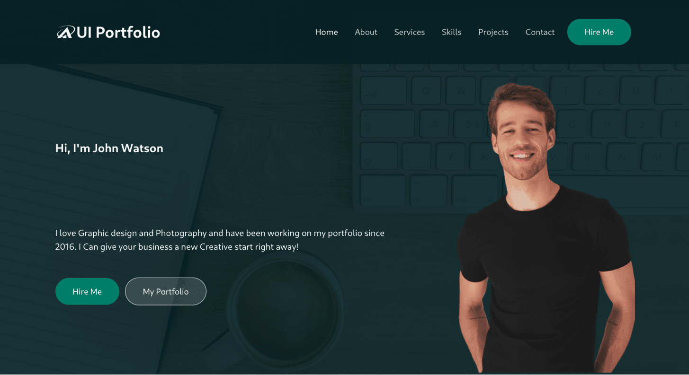

# UI Portfolio

A responsive, modern portfolio template built with HTML, CSS, and JavaScript—designed to showcase your work, skills, and experience in an elegant, user-friendly interface.

## Table of Contents

1. [Demo](#demo)  
2. [Features](#features)  
3. [Tech Stack](#tech-stack)  
4. [Project Structure](#project-structure)  
5. [Installation](#installation)  
6. [Usage](#usage)  
7. [Customization](#customization)  
8. [Deployment](#deployment)  
9. [Contributing](#contributing)  
10. [License](#license)  
11. [Author](#author)  

---

## Demo

**Live Preview:** [Ui-Portfolio](https://group624.netlify.app/)  

  

---

## Features

- **Responsive Design** – Adapts seamlessly from mobile to desktop.  
- **Smooth Scrolling** – Navigation links scroll to sections with smooth animations.  
- **Skills Section** – Progress bars indicate proficiency levels.  
- **Projects Gallery** – Showcases completed projects with overlay details.  
- **Contact Form** – Simple form layout (can be hooked up to a backend).  
- **Social Links** – Icon buttons linking out to social media and GitHub.  

---

## Tech Stack

- **HTML5** – Semantic markup for accessibility  
- **CSS3** – Flexbox & Grid layout, media queries  
- **JavaScript (ES6+)** – DOM manipulation, event handling  
- **Font Awesome** – Icon library  
- **Google Fonts** – Custom typography  

---

## Project Structure

```bash
group_624_web_development-assignment/
├── assets/
│   ├── css/
│   │   └── styles.css
│   ├── images/
│   │   └── logo.png
│   └── js/
│       └── main.js
├── index.html
└── README.md
```

- `assets/css/styles.css` – Main stylesheet  
- `assets/js/main.js` – JavaScript for menu toggle, smooth scroll, etc.  
- `assets/images/` – Placeholder for images/screenshots/logos  
- `index.html` – Single-page layout with sections: Home, About, Skills, Projects, Contact  

---

## Installation

1. Clone the repo

   ```bash
   git clone https://github.com/makauimmaculate/group_624_web_development-assignment.git
   ```

2. Navigate into the folder

   ```bash
   cd group_624_web_development-assignment
   ```

3. Open `index.html` in your preferred browser

No build step required—pure HTML/CSS/JS.

---

## Usage

- **Edit content**:  
  Modify headings, text, and image paths in `index.html`.  

- **Adjust styles**:  
  Update colors, fonts, layout in `assets/css/styles.css`.  

- **Enhance JS behavior**:  
  Tweak scrolling speed or add new interactions in `assets/js/main.js`.  

- **Add projects**:  
  Copy a `.project-item` block in the Projects section and update the link, image, and description.

---

## Customization

- **Branding**  
  - Replace logo and favicon in `assets/images/`.  
  - Swap Google Fonts in the `<head>` of `index.html`.  

- **Color Scheme**  
  - Tweak CSS variables (e.g., `--primary-color`, `--accent-color`) in `styles.css`.  

- **Navigation**  
  - Add/remove menu items by editing the `<nav>` in `index.html` and creating matching sections.

---

## Deployment

### GitHub Pages

1. Push your code to the `main` branch.  
2. Go to Settings > Pages.  
3. Under “Source,” select `main` branch and `/ (root)` folder.  
4. Save—your site will be live at `https://your-username.github.io/group_624_web_development-assignment/`.  

### Netlify / Vercel

1. Connect your GitHub repo.  
2. Select the `main` branch.  
3. Netlify/Vercel auto-deploys on each push.

---

## Contributing

1. Fork this repository  
2. Create your feature branch

   ```bash
   git checkout -b feature/MyFeature
   ```

3. Commit your changes

   ```bash
   git commit -m "Add MyFeature"
   ```

4. Push to branch

   ```bash
   git push origin feature/MyFeature
   ```

5. Open a Pull Request  

Please follow the [Contributor Covenant](https://www.contributor-covenant.org/) code of conduct.

---

## License

This project is distributed under the MIT License. See `LICENSE` for details.

---

## Author

**PLP Group 624**

- Immaculate Mueni  
- Dennis Mungai  
- Ashley Achieng  
- Adeoye Jeremiah  

- GitHub: [@PLPGroup624](https://github.com/makauimmaculate/group_624_web_development-assignment)  

Created with ❤️ by PLP Group 624
